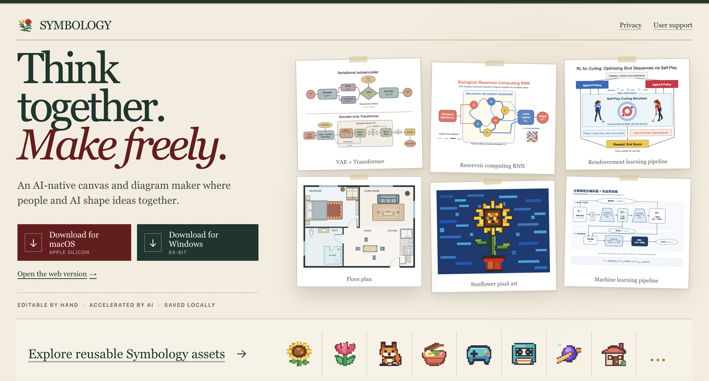

# Sketch to SVG Diagram Agent

Transform sketches into clean SVG diagrams using AI in minutes.

Read our paper: [See it. Say it. Sorted: Agentic System for Compositional Diagram Generation](https://arxiv.org/abs/2508.15222)


---

## From Our Research to Symbology AI Canvas

<p align="center">
  <a href="https://symbology.onrender.com/">
    
  </a>
</p>

<p align="center">
  <strong>Think together. Make freely.</strong><br>
  We built Symbology AI Canvas based on the research introduced in this paper.
</p>

The agentic approach to compositional diagram generation developed in
*See it. Say it. Sorted* became the foundation for **Symbology AI Canvas**: an
AI-native workspace for creating editable diagrams, scientific figures,
flowcharts, and SVG illustrations. It brings the ideas from our research into
a practical canvas where people and AI can shape, inspect, and refine every
part of a visual together.

<p align="center">
  <a href="https://symbology.onrender.com/"><strong>Explore Symbology AI Canvas →</strong></a>
  &nbsp;·&nbsp;
  <a href="https://symbology.onrender.com/login.html">Open the web app</a>
  &nbsp;·&nbsp;
  <a href="https://github.com/hantaoZhangrichard/symbology-downloads/releases/download/v0.1.5/Symbology-0.1.5-arm64.dmg">Download for macOS</a>
  &nbsp;·&nbsp;
  <a href="https://github.com/hantaoZhangrichard/symbology-downloads/releases/download/v0.1.5/Symbology-Setup-0.1.5-x64.exe">Download for Windows</a>
</p>

Describe what you want, refine every shape directly on the canvas, and export
the result as SVG, PDF, PNG, or PowerPoint. Visit the
[Symbology website](https://symbology.onrender.com/) to see what the research
has become and start creating.

### Made with Symbology

<table>
  <tr>
    <td align="center" width="33%">
      <br>
      <sub><strong>VAE + Transformer</strong></sub>
    </td>
    <td align="center" width="33%">
      <br>
      <sub><strong>Reservoir computing RNN</strong></sub>
    </td>
    <td align="center" width="33%">
      <br>
      <sub><strong>Machine-learning pipeline</strong></sub>
    </td>
  </tr>
</table>

Explore the [reusable Symbology asset library](https://github.com/hantaoZhangrichard/symbology-assets).

---


## Quick Start (2 minutes)

### 1. Install Dependencies
```bash
pip install -r requirements.txt
```

### 2. Set API Keys
```python
# In run_agent_svg.ipynb, first cell:
os.environ['GEMINI_API_KEY'] = 'your-gemini-api-key-here'
# or
os.environ['OPENAI_API_KEY'] = 'your-gpt-api-key-here'
# In flowchart editor we used OPENAI API
```

### 3. Add Your Sketch
Save your sketch/diagram as `sketch.jpg` in the project folder

### 4. Run the Agent
Open `run_agent_svg.ipynb` and update:
```python
task_id = 'sketch'  # Your image name without extension
tgt_img_path = f"./{task_id}.jpg"
```

Run all cells → Your SVG appears in `agent_svg/sketch/` folder

## What It Does

- Converts hand-drawn sketches to clean vector graphics
- Supports diagrams with shapes, arrows, and text
- Iteratively improves output to match your sketch
- Works with flowcharts, system diagrams, UI mockups

## Example Usage

```python
# Basic usage
model_name = "gemini-2.5-pro"
agent = Agent(model_name=model_name, 
              target_image_path="./diagram.jpg",
              canvas_w=800, canvas_h=600)

# Generate initial SVG
init_svg = agent.initialize()

# Optimize (runs 5 iterations)
for i in range(5):
    new_svg, info, improved = agent.optimization_step_vlm(
        current_image_path=f"./output/step_{i}.png",
        current_expression=new_svg,
        output_path="./output"
    )
```

## Tips

- **Clear sketches work best**: Use dark lines on white background
- **Add text instructions**: Include labels like "red circle" or "blue arrow"
- **Custom instructions**: Add specific guidance:
  ```python
  cus_instruct = "Focus on arrow directions and text alignment"
  ```

## Output

Find your results in `agent_svg/[task_id]/`:
- `initial.png` - First attempt
- `optimized_1.png` through `optimized_5.png` - Refined versions
- `candidate_*.png` - Alternative options considered

## Troubleshooting

- **No output?** Check API key is valid
- **Poor results?** Try clearer sketch or add custom instructions
- **Installation issues?** Use Python 3.8+

## Using Flowchart Editor

### 1. Start the Web Server
- Open your terminal and run:
  ```bash
  python flowchart_editor/svg_server.py
  ```
- To use a custom port:
  ```bash
  python flowchart_editor/svg_server.py --port 8080
  ```
  (Default port is 8080)

### 2. Open the Webpage
- Visit `http://localhost:8080` in your browser.

### 3. How to Use
- **Draw:** Select a tool and draw on the canvas.
- **Generate:** Click "Generate JSON" to create a JSON representation of your diagram.
- **Save:** Click "Save" to store your diagram in the database.
- **Agent:** Enter text and/or image instructions, then click to let the AI generate or optimize your diagram.
  - Make sure to click "Generate JSON" before interacting with the agent.
  - You can generate an empty JSON and let the agent create a flowchart from scratch.


### Acknowledgement

**Special thanks to Jiaruo Liu, Xiaowen Yin, Yayan Jiang, and Yidan Mei for their valuable contributions to the first version of Symbology.**


### License

Copyright 2025–2026 Hantao Zhang and contributors.

Licensed under the [Apache License 2.0](LICENSE).

### Citation

If you use this work, please cite our paper:

```bibtex
@misc{zhang2025itsayitsorted,
  title={See it. Say it. Sorted: Agentic System for Compositional Diagram Generation},
  author={Hantao Zhang and Jingyang Liu and Ed Li},
  year={2025},
  eprint={2508.15222},
  archivePrefix={arXiv},
  primaryClass={cs.AI},
  url={https://arxiv.org/abs/2508.15222},
}
```
